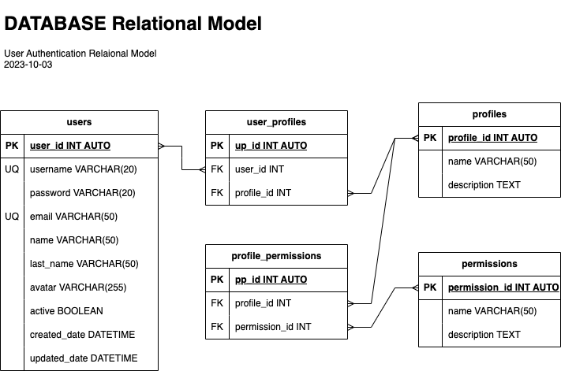

# Authentication System

## Entities

### users **(DE)**
- user_id **(PK)**
- username **(UQ)**
- password
- email **(UQ)**
- name
- last_name
- avatar
- active
- created_date
- updated_date

### profiles **(CE)**
- profile_id **(PK)**
- name
- description

### permissions **(CE)**
- permission_id **(PK)** 
- name
- description

### user_profiles **(PE)**
- up_id **(PK)**
- user_id **(FK)**
- profile_id **(FK)**

### profile_permissions **(PE)**
- pp_id **(PK)**
- profile_id **(FK)**
- permission_id **(FK)**

## Relations
- **users** have **profiles** (_N:M_)
- **profiles** have **permissions** (_N:M_)

## Diagrams

### E-R Model

### Relational Model

## Business Rules

### users
- Create one user
- Read all users
- Read one user
- Update one user
- Delete one user
- Validate username before a creation
- Enable one user
- Disable one user
- Update one user data
- Update one user password

### profiles
- Create one profile
- Read all profiles
- Read one profile
- Update one profile
- Delete one profile

### permissions
- Create one permission
- Read all permissions
- Read one permission
- Update one permission
- Delete one permission

### user_profiles
- Create one user_profile
- Read all user_profiles
- Read all user_profiles from a particular user
- Read one user_profile
- Delete one user_profile

### profile_permissions
- Create one profile_permission
- Read all profile_permissions
- Read all profile_permissions from a particular profile
- Read one profile_permission
- Delete one profile_permission
