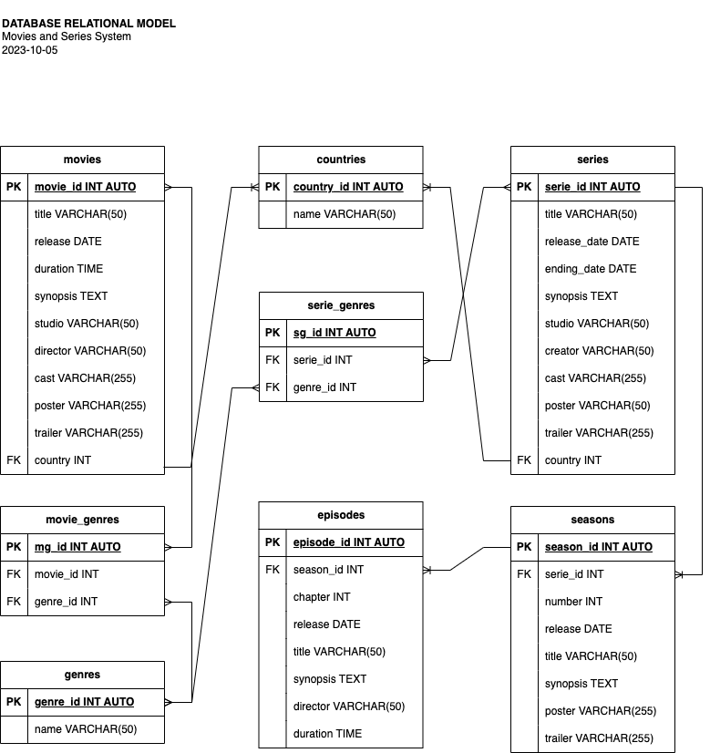

# Movies & TV Shows

## Entities
### movies **(DE)**
- movie_id **(PK)**
- title
- release
- duration
- synopsis
- studio
- director
- cast
- poster
- trailer
- country **(FK)**

### series **(DE)**
- serie_id **(PK)**
- title
- release_date
- ending_date
- synopsis
- studio
- creator
- cast
- poster
- trailer
- country **(FK)**

### seasons **(DE)**
- season_id **(PK)**
- serie_id **(FK)**
- number
- release
- title
- synopsis
- poster
- trailer

### episodes **(DE)**
- episode_id **(PK)**
- season_id **(FK)**
- chapter
- release
- title
- synopsis
- director
- duration

### genres **(CE)**
- genre_id **(PK)**
- name

### countries **(CE)**
- country_id **(PK)**
- name

### movie_genres **(PE)**
- mv_id **(PK)**
- movie_id **(FK)**
- genre_id **(FK)**

### serie_genres **(PE)**
- sg_id **(PK)**
- serie_id **(FK)**
- genre_id **(FK)**

## Relations
1. One **movies** has **countries** (_1:N_).
1. One **series** has **countries** (_1:N_).
1. One **seasons** belongs to **series** (_1:N_).
1. One **episosdes** belongs to **seasons** (_1:N_).
1. **movies** belongs to **genres** (_N:M_).
1. **series** belongs to **genres** (_N:M_).

## Diagrams
### E-R Model
### Relational Model

## Business Rules

### Movies
1. Create one Movie
1. Read one Movie
1. Read all Movies
1. Update one Movie
1. Delete one Movie

### Series
1. Create one Serie
1. Read one Serie
1. Read all Series
1. Update one Serie
1. Delete one Serie

### Seasons
1. Create one season
1. Read one season
1. Read all seasons
1. Update one season
1. Delete one season

### Episodes
1. Create one episose
1. Read one episose
1. Read all episoses
1. Update one episose
1. Delete one episose

### Countries
1. Create one country
1. Read one country
1. Read all countries
1. Update one country
1. Delete one country

### Genres
1. Create one genre
1. Read one genre
1. Read all genres
1. Update one genre
1. Delete one genre

### Movie_Genres
1. Create one Movie Genre
1. Read all Movies Genre from a Movie
1. Delete one Movie Genre

### Serie_Genres
1. Create one Series Genre
1. Read all Series Genre from a Serie
1. Delete one Series Genre
