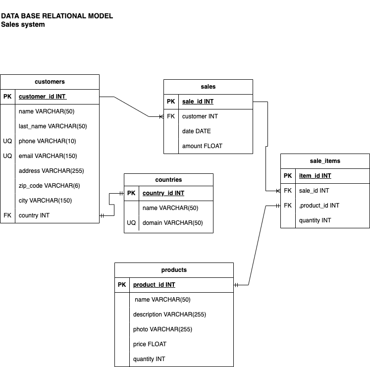

# Sales

## Entities 

### Customers **(DE)**
- customer_id **(PK)**
- name
- last_name
- phone **(UQ)**
- email **(UQ)**
- address
- zip_code
- city
- country **(FK)**

### Products **(DE | CE)**
- product_id **(PK)**
- name
- description
- photo
- price
- quantity

### Sales **(DE)**
- sale_id **(PK)**
- customer **(FK)**
- product **(FK)**
- date
- amount

### sale_items **(PE)**
- item_id **(PK)**
- sale_id **(FK)**
- product_id **(FK)**
- quantity

### countries **(CE)**
- country_id **(PK)**
- name
- domain **(UQ)**

### relations
1. One **customer** has a **country** (_1:1_)
1. One **customer** generates **sale** (_1:N_)
1. One **sale** has **item** (_1:N_)
1. One **item** is a **product** (_1:1_)

## Diagrams

### E-R Model

### Relational Model

## Business Rules

### Customer
1. Create one customer
1. List all customers
1. List one customer
1. Update one customer
1. Delete one customer

### Products
1. Create one product
1. List all products
1. List one product
1. Update one product
1. Delete one product
1. Decrease the product quantity on every sale

### Sales
1. Create one sale
1. List all sales
1. List one sale
1. List one sale from a specified customer
1. List all sales from a specified customer
1. List all sales from a specified product
1. Update one sale
1. Delete one sale

### sale_items
1. Create one item
1. List all items
1. List one item
1. List all items from a specified sale
1. List all items from a specified product
1. List all items from a specified customer
1. Update one item
1. Delete one item

### Countries
1. Create one country
1. List all countries
1. List one country
1. Update one country
1. Delete one country

