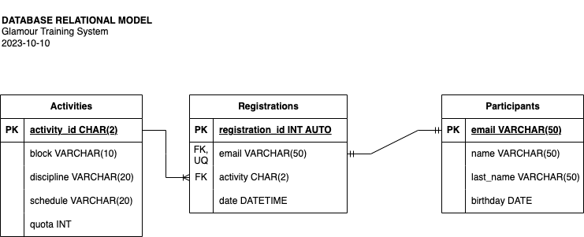

# _Glamour Training_ System

## System Requirements
- Register glamour training participants.
- The event will have 4 disciplines: _KickBoxing_, Pilates, Yoga and Zumba.
- Every discipline will have three time blocks:
    - Block 1 from 9:00 to 12:00 Hrs    
    - Block 2 from 14:00 to 17:00 Hrs    
    - Block 3 from 18:00 to 21:00 Hrs    
- Ever activity will have 10 participants maximum, except Yoga. It will have 20.
- Every participant will be able to subscribe only one activity.

## Entities

### Activities **(EC)**
- activity_id **(PK)**
- block
- discipline
- schedule
- quota

| activity_id | block | discipline | schedule | quota |
| ----------- | ----- | ---------- | -------- | ----- |
| 1K | Block 1 | KickBoxing | 9:00 - 12:00 | 10 |
| 1Y | Block 1 | Yoga | 9:00 - 12:00 | 20 |
| 1P | Block 1 | Pilates | 9:00 - 12:00 | 10 |
| 1Z | Block 1 | Zumba | 9:00 - 12:00 | 10 |
| 2K | Block 2 | KickBoxing | 14:00 - 17:00 | 10 |
| 2Y | Block 2 | Yoga | 14:00 - 17:00 | 20 |
| 2P | Block 2 | Pilates | 14:00 - 17:00 | 10 |
| 2Z | Block 2 | Zumba | 14:00 - 17:00 | 10 |
| 3K | Block 3 | KickBoxing | 18:00 - 21:00 | 10 |
| 3Y | Block 3 | Yoga | 18:00 - 21:00 | 20 |
| 3P | Block 3 | Pilates | 18:00 - 21:00 | 10 |
| 3Z | Block 3 | Zumba | 18:00 - 21:00 | 10 |

### Participants **(DE)**
- email **(PK)**
- name
- last_name
- birthday

### Registrations **(DE | PE)**
- registration_id **(PK)**
- email **(FK)**
- activity **(FK)**
- date

## Relations
1. One **Participants** creates one **Registrations** (_1:1_)
1. One **Activities** is asigned to many **Registrations** (_1:N_)

## Diagrams
### E-R Model
### Relational Model

## Business Rules

### Activities
1. Create one Activity
1. Read all Activities
1. Read one Activity
1. Update one Activity
1. Delete one Activity

### Participants
1. Create one Activity
1. Read all Activities
1. Read one Activity
1. Update one Activity
1. Delete one Activity

### Registrations
1. Create one Activity
1. Read all Activities
1. Read one Activity
1. Update one Activity
1. Delete one Activity

### System Requisites based logic and validations
- One participant registration implies:
    - Activity quota validation
    - Data insertions into participants and registrations entities
    - Substract 1 to "quota" attibute from Activities entity
- Registrations listing
- One participant deletion implies:
    - Data deletion into participants and registrations entities
    - Add 1 to "quota" attibute from Activities entity