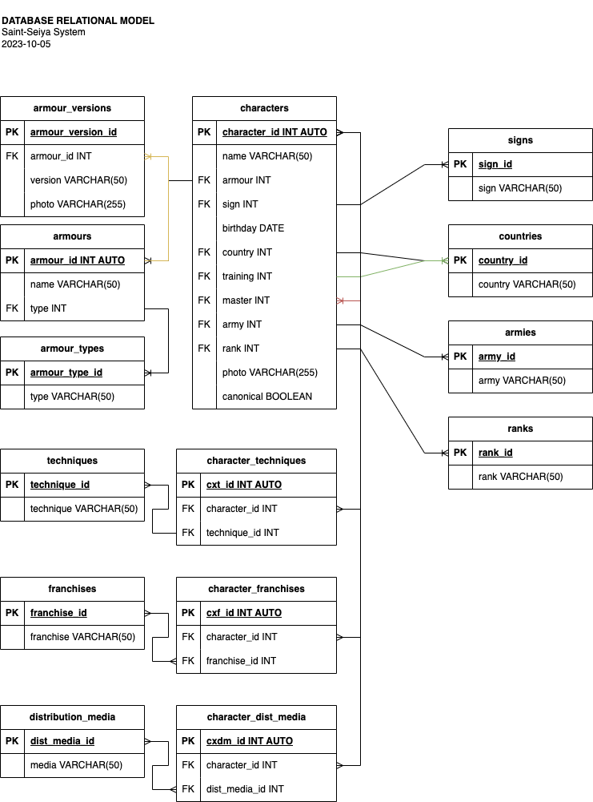

# Saint-Seiya System

## Entities
### characters **(DE)**
- character_id **(PK)**
- name
- armour **(FK)**
- sign **(FK)**
- birthday
- country **(FK)**
- training **(FK)**
- master **(FK)**
- army **(FK)**
- rank **(FK)**
- photo
- canonical

### armours **(CE)**
- armour_id **(PK)**
- armour_name
- armour_type **(FK)**

### armour_types **(CE)**
- armour_type_id **(PK)**
- armour_type

### armour_versions **(CE | PE)**
- armour_version_id **(PK)**
- armour_id **(FK)**
- version
- photo

### signs **(CE)**
- sign_id **(PK)**
- sign

### countries **(CE)**
- country_id **(PK)**
- country

### armies **(CE)**
- army_id **(PK)**
- army

### ranks **(CE)**
- rank_id **(PK)**
- rank

### techniques **(CE)**
- technique_id **(PK)**
- technique

### character_techniques **(PE)**
- ct_id **(PK)**
- character_id **(FK)**
- technique_id **(FK)**

### franchises **(CE)**
- franchise_id **(PK)**
- franchise

### character_franchises **(PE)**
- cf_id **(PK)**
- character_id **(FK)**
- franchise_id **(FK)**

### distribution_media **(CE)**
- dist_media_id **(PK)**
- media

### character_distribution_media **(PE)**
- cdm_id **(PK)**
- character_id **(FK)**
- dist_media_id **(FK)**

## Relations
1. One **characters** has many **armours** (_1:N_).
1. One **characters** belongs to many **signs** (_1:N_).
1. One **characters** belongs to many **countries** (_1:N_).
1. One **characters** trained in many **countries** (_1:N_).
1. One **characters** has many **masters** (_1:N_).
1. One **characters** has many **armies** (_1:N_).
1. One **characters** has many **ranks** (_1:N_).
1. One **armours** has many **armour_types** (_1:N_).
1. One **armours** has many **armour_versions** (_1:N_).
1. Many **characters** own many **techniques** (_M:N_).
1. Many **characters** belong to many **franchises** (_M:N_).
1. Many **characters** belong to many **distribution_media** (_M:N_).

## Diagrams
### E-R Model
### Relational Model

## Business Rules

### characters
1. Create one character
1. Read all characters
1. Read one character
1. Update one character
1. Delete one character

### armours
1. Create one armour
1. Read all armours
1. Read one armour
1. Update one armour
1. Delete one armour

### armour_types
1. Create one armour_type
1. Read all armour_types
1. Read one armour_type
1. Update one armour_type
1. Delete one armour_type

### armour_versions
1. Create one armour_version
1. Read all armour_versions
1. Read one armour_version
1. Update one armour_version
1. Delete one armour_version

### signs
1. Create one sign
1. Read all signs
1. Read one sign
1. Update one sign
1. Delete one sign

### countries
1. Create one country
1. Read all countries
1. Read one country
1. Update one country
1. Delete one country

### armies
1. Create one army
1. Read all armies
1. Read one army
1. Update one army
1. Delete one army

### ranks
1. Create one rank
1. Read all ranks
1. Read one rank
1. Update one rank
1. Delete one rank

### techniques
1. Create one technique
1. Read all techniques
1. Read one technique
1. Update one technique
1. Delete one technique

### franchises
1. Create one franchise
1. Read all franchises
1. Read one franchise
1. Update one franchise
1. Delete one franchise

### distribution_media
1. Create one distribution_media
1. Read all distribution_media
1. Read one distribution_media
1. Update one distribution_media
1. Delete one distribution_media

### character_techniques
1. Create one character
1. Read all characters
1. Delete one character

### character_franchises
1. Create one character
1. Read all characters
1. Delete one character

### character_distribution_media
1. Create one character
1. Read all characters
1. Delete one character
