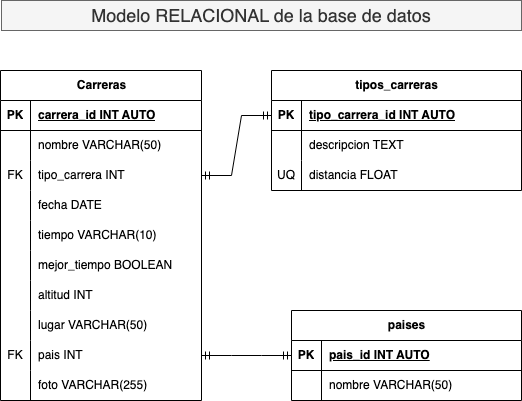

# Maratones

1. Identificar las entidades del sistema. 
2. Identificar los atributos de las entidades.
3. Identificar las llaves primarias y foráneas de las entidades
4. Asignar una nomenclatura adecuada a las entidades y sus atributos (sintáxis)
5. Identificar las entidades pivotes del sistema
6. Identificar los catálogos del sistema
7. Identificar los tipos de relaciones del sistema
8. Crear el modelo entidad-relacion del sistema
9. Crear el modelo relacional de la base de datos del sistema
10. Identificar los tipos de datos de los atributos de las entidades del sistema
11. Identificar los atributos que pueden ser únicos en el sistema
12. Identificar las reglas de negocio (CRUD) del sistema

## Listado de entidades
- Carreras
- Tipos de carreras
- Paises

## Listado de entidades y atributos
### Carreras
- Id de carrera
- Nombre
- Tipo de carrera
- Fecha
- Tiempo
- Mejor tiempo
- Altitud
- Lugar
- País
- Foto

### Tipo de Carreras
- Id del tipo de carrera
- Descripcion
- Distancia

### Paises
- Id de país
- nombre del país

## Listado de entidades y atributos + llaves primarias y foraneas
### Carreras
- Id de carrera **(PK)**
- Nombre
- Tipo de carrera **(FK)**
- Fecha
- Tiempo
- Mejor tiempo
- Altitud
- Lugar
- País **(FK)**
- Foto

### Tipo de Carreras
- Id del tipo de carrera **(PK)**
- Descripcion
- Distancia

### Paises
- Id de país **(PK)**
- nombre del país

## Nomenclatura para entidades y atributos
### carreras
- carrera_id **(PK)**
- carrera_nombre
- tipo_carrera **(FK)**
- fecha
- tiempo
- mejor_tiempo
- altitud
- lugar
- pais **(FK)**
- foto

### tipos_carreras
- tipo_carrera_id **(PK)**
- descripcion
- distancia

### paises
- pais_id **(PK)**
- pais_nombre

## Entidades pivotes

* NO HAY

## Catálogos del sistema

### carreras
- carrera_id **(ED)**
- carrera_nombre
- tipo_carrera **(FK)**
- fecha
- tiempo
- mejor_tiempo
- altitud
- lugar
- pais **(FK)**
- foto

### tipos_carreras
- tipo_carrera_id **(EC)**
- descripcion
- distancia **UQ**

### paises
- pais_id **(ED)**
- pais_nombre

## Glosario
- **PK**: _Primary Key_
- **FK**: _Foreign Key_
- **ED**: _Entidad Datos_
- **EC**: _Entidad Catálogo_
- **EP**: _Entidad Pivote_
- **UQ**: _Atributo Unico_
- \*\*\*\*

## Relaciones

1. Una **carrera** _pertence_ a **tipo de carrera** (1:1)
2. Una **carrera** se _corre_ en un **pais** (1:1)

## Diagramas
### Carreras Modelo entidad-relacion

### Carreras Modelo Relacional

## Reglas de negocio del sistema (CRUD)

### Carreras
1. Crear el registro de una carrera
1. Actualizar los datos de una carrera
1. Leer el registro de una carrera en particular
1. Leer el registro de un conjunto de carreras en base a un conjunto de condiciones dadas.
1. Leer todos los registros de una carrera.
1. Eliminar los datos de una carrera dada una condición particular.

### Tipos Carreras
1. Crear el registro de un tipo de carrera
1. Leer todos los registro de la entidad tipos de carrera   
1. Leer un registro de la entidad tipos de carrera dada una condición en particular.
1. Leer un conjunto de registros de la entidad tipos de carrera dada una condición en particular.
1. Actualizar un registro de la entidad tipos de carrera dada una condición en particular.
1. Actualizar un conjunto de registros de la entidad tipos de carrera dada una condición en particular.
1. Eliminar un registro de la entidad tipos de carrera dada una condición en particular.

### Paises
1. Crear un registro en la entidad paises
1. Leer todos registros en la entidad paises
1. Leer todos registros en la entidad paises dada una determinada condición.
1. Leer un registro en la entidad paises dada una determinada condición.
1. Leer un conjunto de registros en la entidad paises dada una determinada condición.
1. Actualizar un registro en la entidad paises dada una determinada condición.
1. Actualizar un conjunto de registros en la entidad paises dada una determinada condición.
1. Eliminar un registro en la entidad paises dada una determinada condición.