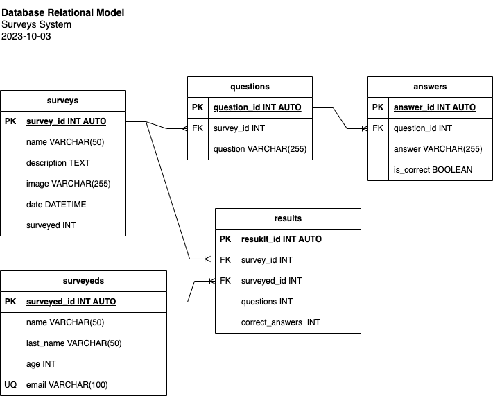

# Surveys

## Entities

### surveys **(DE)**

- survey_id **(PK)**
- name
- description
- image
- date
- surveyed

### questions **(DE)**

- question_id **(PK)**
- survey_id **(FK)**
- question

### answers **(DE)**
- answer_id **(PK)**
- question_id **(FK)**
- answer
- is_correct

### surveyed **(DE)**
- surveyed_id **(PK)**
- name
- last_name
- age
- email **(UQ)**

### results **(DE | PE)**
- result_id **(PK)**
- survey_id **(FK)**
- surveyed_id **(FK)**
- questions 
- correct_answers

## Relations
1. One **survey** has **questions** (_1:N_)
1. One **question** has **answers** (_1:N_)
1. One **survey** has **results** (_1:N_)
1. One **surveyed** has **results** (_1:N_)

## Diagrams

### E-R Model

### Relational Model

## Business Rules

### surveys
1. Create one survey
1. Read all surveys
1. Read one survey
1. Update one survey
1. Delete one survey
1. Increase in ONE the "surveyed" field everytime a survey is completed

### questions
1. Create one question
1. Read all questions
1. Read one question
1. Update one question
1. Delete one question

### answers
1. Create one answer
1. Read all answers
1. Read one answer
1. Update one answer
1. Delete one answer

### surveyeds
1. Create one surveyed
1. Read all surveyeds
1. Read one surveyed
1. Update one surveyed
1. Delete one surveyed
1. Before creating a surveyed, verify the new 'email' value doesn't exist. 

### results
1. Create one result
1. Read all results
1. Read one result
1. Update one result
1. Delete one result