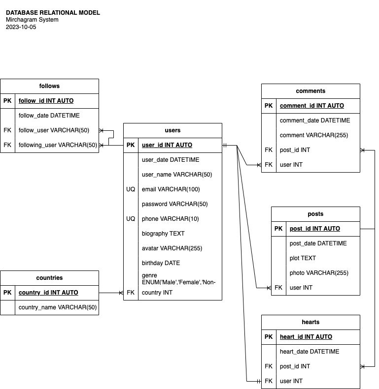

# MirchaGram

## Entities
### posts **(DE)**
- post_id **(FK)**
- post_date
- plot
- photo
- user **(FK)**

### users **(DE)**
- user_id **(PK)**
- user_date
- user_name
- email **(UQ)**
- password
- phone **(UQ)**
- biography
- avatar
- birthday
- genre
- country **(FK)**

### countries **(CE)**
- country_id **(PK)**
- country_name

### comments **(DE | PE)
- comment_id **(PK)**
- comment_date
- comment
- post_id **(FK)**
- user **(FK)**

### hearts **(DE | PE)**
- heart_id **(PK)**
- heart_date
- post_id **(FK)**
- user **(FK)**

### follows
- follow_id **(PK)**
- follow_date
- follow_user **(FK)**
- following_user **(FK)**

## Relations
- **users** publish **posts** (_1:N_)
- **users** write **comments** (_1:N_)
- **posts** have **comments** (_1:N_)
- **users** give **hearts** (_1:1_)
- **posts** have **hearts** (_1:N_)
- **users** have **follows** (_1:N_)
- **users** follow **follows** (_1:N_)
- **users** have one **countries** (_1:N_)

## Diagrams
### E-R Model
### Relational Model

## Business Rules
### posts
1. Create one POST
1. Read all POSTS
1. Read all POSTS from a particular USER
1. Read one POST
1. Update the POST 'plot'
1. Delete one POST

### users
1. Create one USER
1. Read all USERS
1. Read one USER
1. Validate one USER
1. Update one USER 'DATA'
1. Update one USER 'PASSWORD'
1. Delete one USER

### comments
1. Create one POST COMMENT
1. Read all POST COMMENTS
1. Read one POST COMMENT
1. Count one POST COMMENTS
1. Delete one POST COMMENT

### hearts
1. Create one USER POST HEART
1. Count all USER POST HEARTS
1. Delete one USER POST HEART

### follows

1. Create one USER FOLLOW
1. Count all USER FOLLOWS
1. Count all USER FOLLOWINGS
1. Delete one USER FOLLOW

### countries
1. Create one COUNTRY
1. Read all COUNTRIES
1. Read one COUNTRY
1. Update one COUNTRY
1. Delete one COUNTRY
